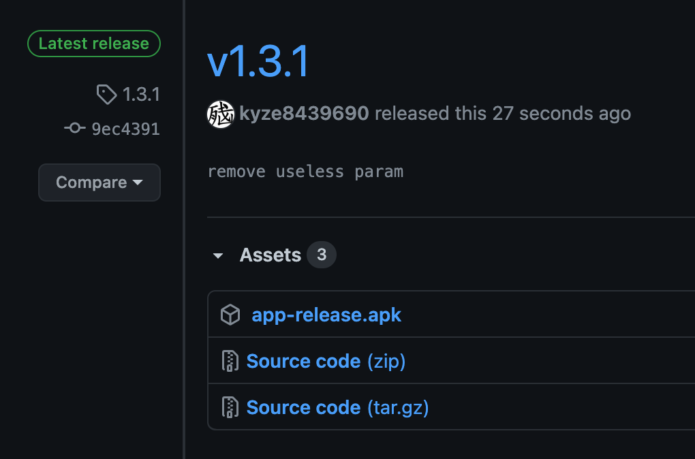

# action-release-releaseapk



🕷 Build and release release APK when your push a new tag

## Usage

To use the action simply add the following lines to your `.github/workflows/android.yml` and provide the required Secrets and Environment variables.

#### YML
```
name: Build & Publish Release APK

on:
  push:
    tags:
      - '*'

jobs:
  Gradle:
    runs-on: ubuntu-latest
    steps:
    - name: checkout code
      uses: actions/checkout@v2
    - name: setup jdk
      uses: actions/setup-java@v1
      with:
        java-version: 11
    - name: Make Gradle executable
      run: chmod +x ./gradlew
    - name: Build Release APK
      run: ./gradlew assembleRelease
    - name: Releasing using Hub
      uses: kyze8439690/action-release-releaseapk@master
      env:
       GITHUB_TOKEN: ${{ secrets.TOKEN }}
       APP_FOLDER: app
```

### Secrets

You'll need to provide this secret token to use the action (for publishing the APK). Enter these secrets in your Settings > Secrets

* **TOKEN**: Create a new [access token](https://github.com/settings/tokens) with `repo` access.

I am unsure as to why using the default `GITHUB_TOKEN` provided universally will fail to authorize the user. This is the only workaround that I'd found.

### Environment Variables

You'll need to provide these environment variables to specify exactly what information is needed to build the APK.

* **APP_FOLDER**: main folder to search for the apk. Most of the time, it's `app`

## Credits

Based off [ShaunLWM/action-release-debugapk](https://github.com/ShaunLWM/action-release-debugapk)
